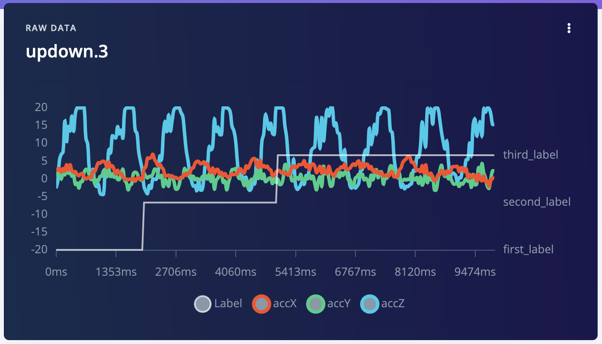

# Uploading / updating multi-label samples using the Edge Impulse API

This repo contains examples on how to use the Edge Impulse APIs to upload and update [multi-label](https://docs.edgeimpulse.com/docs/edge-impulse-studio/data-acquisition/multi-label) timeseries data.

1. Load an Edge Impulse API Key:

    ```
    export EI_PROJECT_API_KEY=ei_e124...
    ```

    > **Note:** Multi-label is not supported on Community projects.

2. To upload a sample with multiple labels you need to provide a structured labels file alongside your data. This is an additional file that contains the labels for all files you upload. In this repo these are [updown.3.json](updown.3.json) (data) and [structured_labels.labels](structured_labels.labels) (labels file). You can upload them via:

    ```
    sh upload.sh
    ```

3. To update the sample with the API:

    ```
    sh update-sample.sh --project-id <pid> --sample-id <sid>
    ```

    Replace `<pid>` with the project ID, and `<sid>` with the sample ID (both returned by `upload.sh`)

## Example results

After uploading the sample:


After updating the sample:


